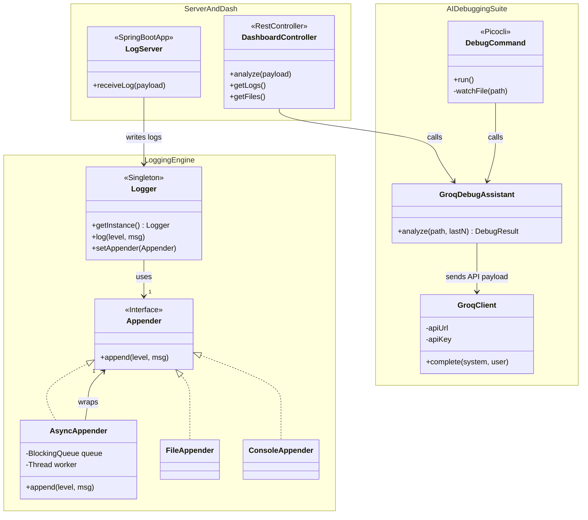
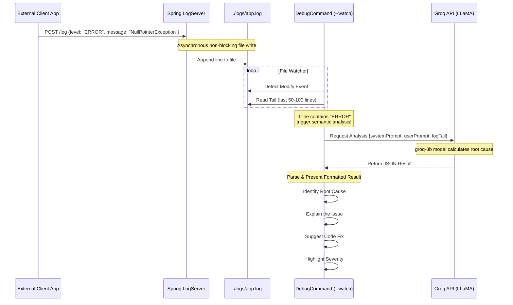

# 🚀 Custom Logger Protocol with Groq AI Debugging

An end-to-end logging ecosystem built in Java that features a high-throughput async logging framework, a Spring Boot log aggregation server, and an intelligent debugging suite powered by **Groq**.

The framework not only collects and stores logs efficiently but also proactively monitors them to catch errors and suggests code-level fixes using cutting-edge LLMs (LLaMA via GroqCloud).

## 🌟 Key Features

* **High-Performance Core:** Hand-rolled asynchronous, thread-safe logger utilizing the Producer-Consumer pattern and Double-Checked Locking.
* **Centralized Log Server:** A Spring Boot REST application that ingests logs from distributed sources over HTTP.
* **Intelligent Debug CLI:** A Picocli command-line tool equipped with a `--watch` mode to monitor your logs in real-time. When it spots an `ERROR`, it automatically streams the recent context to Groq to generate a root cause analysis!
* **Web Dashboard:** A Thymeleaf-based UI providing quick access to your raw logs alongside one-click AI analysis.

---

## 🏗️ Architecture & Class Structure

The project is structured into three main layers: The core logging engine, the server/dashboard layer, and the AI debugging suite.



---

## 🔄 Automatic AI Debugging Workflow

One of the standout features of this project is the real-time AI debug pipeline. The CLI is capable of attaching itself to a log file via `WatchService`. When a log event triggers an `ERROR`, it captures the temporal context, filters the log tail, and immediately requests an action plan from the Groq API.



---

## 🛠️ Usage & Setup

### 1. Configure the API Key
To utilize the AI debugging endpoints, inject your Groq API key (starts with `gsk_`) into your environment variables:

**Windows PowerShell:**
```powershell
$env:GROQ_API_KEY="your_groq_key_here"
```

**Linux/Mac:**
```bash
export GROQ_API_KEY="your_groq_key_here"
```

### 2. Build & Start the Server
Compile the project and start the Spring Boot web server to begin receiving logs and launching the Web UI.

```bash
mvn clean install
mvn spring-boot:run
```
Visit `http://localhost:8080/` to access the Debug Dashboard.

### 3. Run the CLI Debugger
You can analyze existing local files or run the command in `--watch` mode to monitor them dynamically.

**Analyze interactively:**
```bash
java -cp target/logger-cli.jar com.shubham.logger.cli.DebugCommand --file ./logs/app.log
```

**Real-time Watch mode:**
```bash
java -cp target/logger-cli.jar com.shubham.logger.cli.DebugCommand --file ./logs/app.log --watch
```